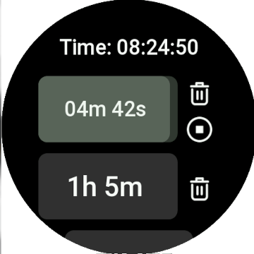

# zeppos-my-timers

An app helps to create custom timers

In development

# Installation

1. Install npm from this article https://docs.npmjs.com/downloading-and-installing-node-js-and-npm
2. Install zeus cli app https://docs.zepp.com/docs/guides/tools/cli/
3. In project folder run `npm i`
4. Then run `zeus preview`
5. Scan QR code with Zepp App on your mobile phone.
6. Enjoy!

